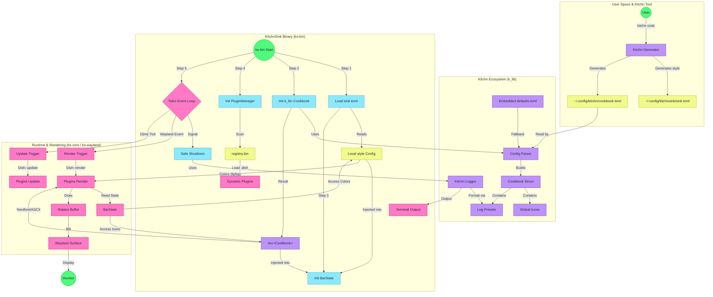

# Architecture & Workflow

This document details the high-level architecture of `kitchnsink` and its deep integration with the `kitchn` ecosystem (`k_lib`).

## The Entangled Workflow

`kitchnsink` relies on `k_lib` for its ecosystem integration, but maintains its own configuration. The `kitchn` tool acts as a "cook" that generates this configuration.

## Key Integration Points

### 1. The Configuration (Generated vs. Shared)
*   **Colors (Generated)**: The `kitchn` tool generates the `[style]` section in `sink.toml`. `kitchnsink` reads this locally. This means `kitchnsink` has its own theme definition, but it is *derived* from the central `kitchn` theme during the "cooking" process.
*   **Icons (Shared)**: Icons are retrieved dynamically from the shared `k_lib::Cookbook`. The `kitchnsink` configuration doesn't store the icons themselves, but rather looks them up by semantic name (e.g., "lightning") from the loaded `Cookbook`.
*   **Logging (Embedded Defaults)**: `k_lib` compiles with a built-in `defaults.toml` containing standard log messages (like logic for "startup" or "shutdown"). Your local `cookbook.toml` is used only to *override* or extend these defaults. This is why `kitchnsink` has "defaults" even if your config file is empty.

### 2. The Dish Registry
Plugins are managed via a persistent registry (`registry.bin`). This allows `kitchnsink` to remember which plugins are enabled or disabled without editing configuration files.

### 3. Rendering Pipeline
*   **Colors**: Dishes access colors via `state.config.style` (Local).
*   **Icons**: Dishes access icons via `state.cookbook.icons` (Global/Shared).

## Workflow Breakdown (Step-by-Step)

For those who prefer reading over diagrams, here is the complete lifecycle:

### 1. Preparation Phase (User Space)
Before `kitchnsink` even starts, the `kitchn` tool plays a crucial role. When you run `kitchn cook`:
1.  It reads your global theme settings.
2.  It generates a specific `sink.toml` configuration file for `kitchnsink`, injecting the correct colors into the `[style]` section.
3.  It ensures the shared `cookbook.toml` is up to date.

### 2. Initialization Phase (ks-bin)
When `ks-bin` launches, it performs a 4-step startup sequence:
1.  **Metric Loading**: It reads `sink.toml`. It sees the locally defined colors (fg, bg) generated by the cook step above.
2.  **Shared Wisdom**: It initializes the `k_lib::Cookbook`. This loads the global icons (Nerdfont vs ASCII) and the logging dictionary. If your local `cookbook.toml` is empty, it seamlessly falls back to the **embedded system defaults** compiled into the binary.
3.  **State Creation**: It combines the local config and the shared cookbook into a unified `BarState`.
4.  **Plugin & Registry**: It initializes the `PluginManager`, which scans `registry.bin` to see which dishes are currently installed and enabled. It then dynamically loads these plugins (.dish files) into memory.

### 3. The Runtime Loop
Once initialized, the application enters an asynchronous event loop (Tokio):
*   **The Pulse (Update)**: Every 16ms (or as configured), a tick triggers the `update()` method on all active dishes. Dependencies like CPU usage or Battery levels are checked here.
*   **The Paint (Render)**: When the Wayland compositor requests a new frame, the `render()` method is called.
    *   The Dish asks `BarState` for the current theme colors (from `sink.toml`).
    *   The Dish asks `BarState` for the correct icon for "cpu" (from `k_lib` Cookbook).
    *   The Dish draws itself to a `Ratatui` buffer.
*   **The Display**: The buffer is blitted (copied) onto the Wayland surface and presented on your screen.

### 4. Shutdown
When you send a signal (like Ctrl+C), the application initiates a "Safe Shutdown". It uses the `Kitchn Logger` to print a goodbye message—formatted exactly according to the `shutdown` preset defined in the embedded defaults or your custom cookbook.
